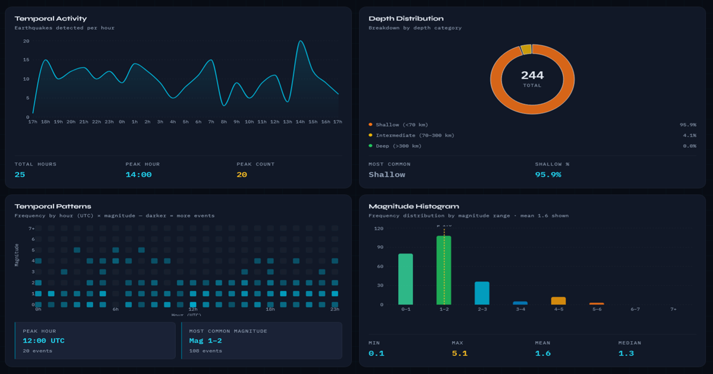

# [Project Name]

> A fast, considered web experience built with precision. 

### [Live Production Preview](https://epicenterhub.madebyever.com/)

---

## Core Focus

EpicenterHub is a real-time seismic monitoring dashboard pulling live data from the USGS Earthquake API. Consolidating chart dependencies, typing the entire USGS GeoJSON surface, and layering in React Query, Zustand, and a portal-rendered detail drawer — without touching the live data pipeline.

## The Tech Stack

* **Framework:** Next.js (App Router)
* **Data fetching:** React Query + usgsApi.ts
* **State:** Zustand — dashboardStore
* * **Language:** TypeScript

## Key Features

* **types:** A single types/earthquake.ts file now defines the full USGS GeoJSON surface — every property, every nullable field, the coordinate tuple typed as[number, number, number] rather than number[].
* **Charts:** All four were written in Recharts.
* **Map:** Leaflet + react-leaflet split into MapView.tsx (SSR-safe wrapper) and MapClient.tsx (browser-only).
